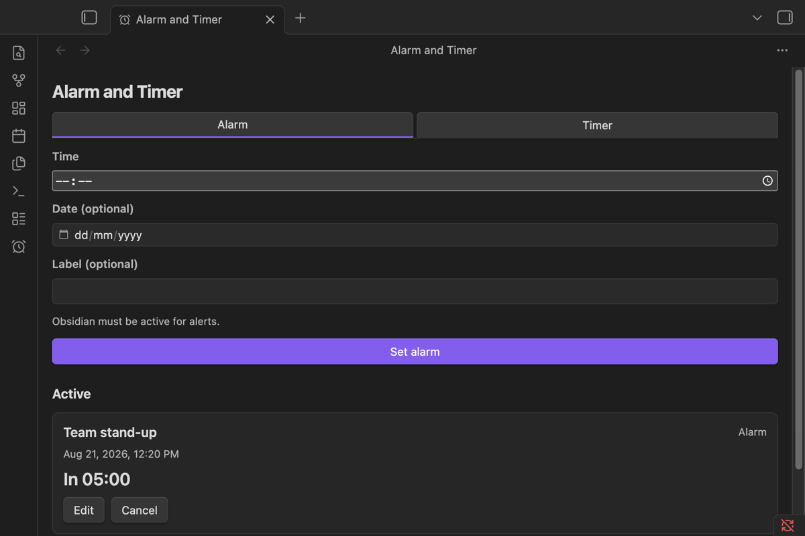
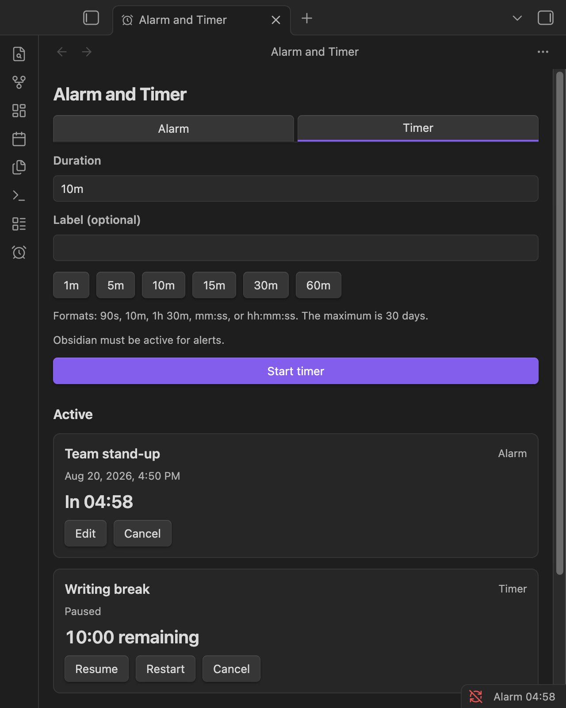
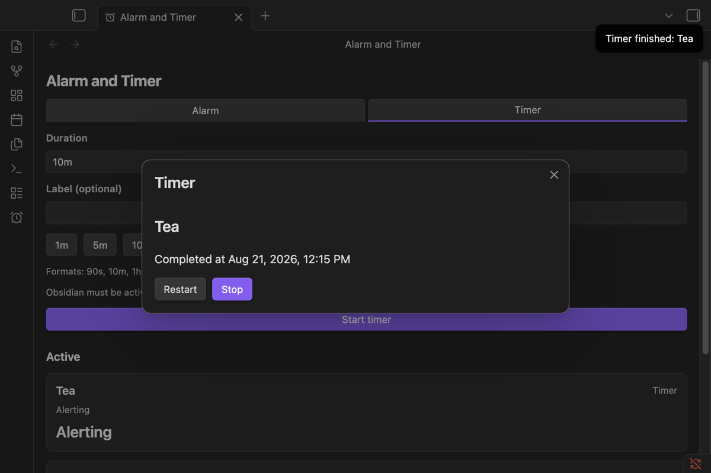

# Alarm and Timer for Obsidian

Set alarms and run multiple countdown timers without leaving Obsidian. Schedules use absolute timestamps, so sleeping or suspending the app never makes a countdown drift. Please note that alerts work only while Obsidian is running.

## Features

- Alarms with an optional date and label.
- As many countdown timers as you need, with pause, resume, restart, and cancel.
- In-app alerts with an optional sound and optional system notifications.
- A sidebar view, an optional status-bar countdown, and command-palette controls.
- Quick-start timer buttons you can configure in settings.
- Seven interface languages that follow Obsidian's language setting.
- Fully offline: no account, no telemetry, no network requests.

## Screenshots

### Schedule an alarm



### Control countdown timers



### Respond to a finished timer



## How to use

Select the alarm-clock icon in the ribbon to open the sidebar.

**Alarms:** open the **Alarm** tab, pick a time (and optionally a date and label), then select **Set alarm**. Without a date, the alarm rings at the next occurrence of that time. Use **Edit** or **Cancel** on an active alarm, and **Stop** to acknowledge it when it rings.

**Timers:** open the **Timer** tab, enter a duration or use a quick button, then select **Start timer**. Durations accept `90s`, `10m`, `1h 30m`, `mm:ss`, or `hh:mm:ss`, from one second up to 30 days. While a timer runs you can **Pause**, **Resume**, **Restart**, or **Cancel**; when it finishes, **Restart** runs the same duration again.

**Commands:** the command palette can open the sidebar, set an alarm, start a timer, stop a ringing alert, clear the history, and pause, resume, restart, or cancel the next scheduled item. Commands appear only while they can actually do something.

## When Obsidian is closed

The plugin has no background process, so nothing can ring while Obsidian is fully closed. When Obsidian becomes active again:

- an item overdue by less than the grace period (configurable in settings) rings normally;
- older items are marked **Missed** and never ring. A recent miss shows a quiet notice, while an old one just goes to History.

## Installation

Install it from **Settings → Community plugins** once it is accepted into the directory.

To install manually, download `main.js`, `manifest.json`, and `styles.css` from the latest GitHub release into `<vault>/.obsidian/plugins/alarm-timer/`, restart Obsidian, and enable **Alarm and Timer**.

## Troubleshooting

- **No sound:** check **Enable sound**, the plugin volume, and your device audio, then use **Test sound** in settings.
- **No system notification:** check the operating-system permission, then re-enable **System notifications**. The in-app alert always remains.
- **An item shows as Missed:** it came due while Obsidian was inactive for longer than the grace period.

Something else? Report it on the [issue tracker](https://github.com/onlinealarmkur/obsidian/issues) with your Obsidian version, plugin version, and platform.

## Privacy

Everything stays on your device. Alarms, timers, labels, and settings live in Obsidian's plugin data store; the plugin never reads your notes, writes files to your vault, collects analytics, or makes network requests. The only external pages are GitHub and the author's online alarm clock, and they open only when you click a link.

## Platform support

Desktop only (macOS, Windows, Linux) by design. Mobile systems suspend Obsidian in the background, so no ordinary plugin can ring reliably there once the device locks or the app is backgrounded.

## Development

Requires Node.js 24.

```bash
npm ci --legacy-peer-deps
npm test
npm run build
```

`npm run check` runs the full gate: lint, strict type checks, tests with coverage, release validation, and a production build. The generated `main.js` is never committed; releases are published from GitHub tags.

## Author and license

Built by Burak Ozdemir, creator of [Online Alarm Kur](https://onlinealarmkur.com/en/), an online alarm clock and timer. [MIT License](LICENSE).
